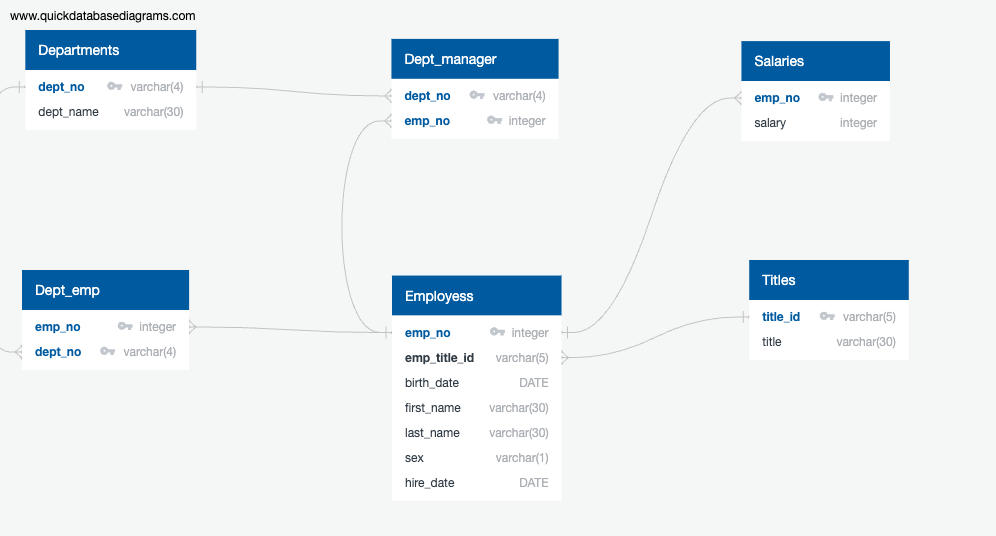

# Kai-sql-challenge

## Background
-It’s been two weeks since you were hired as a new data engineer at Pewlett Hackard (a fictional company). Your first major task is to do a research project about people whom the company employed during the 1980s and 1990s. All that remains of the employee database from that period are six CSV files.
For this project, you’ll design the tables to hold the data from the CSV files, import the CSV files into a SQL database, and then answer questions about the data. That is, you’ll perform data modelling, data engineering, and data analysis, respectively.

## Data Modelling

## Data Engineering
-Use the provided information to create a table schema for each of the six CSV files. Be sure to do the following:
Remember to specify the data types, primary keys, foreign keys, and other constraints.
For the primary keys, verify that the column is unique. Otherwise, create a composite key Links to an external site., which takes two primary keys to uniquely identify a row.
Be sure to create the tables in the correct order to handle the foreign keys.

-Import each CSV file into its corresponding SQL table.

## Reference
- WHERE EXTRACT(YEAR FROM e.hire_date) = 1986;

- WHERE 
    first_name = 'Hercules' AND last_name LIKE 'B%';

-from chatgpt, https://chat.openai.com/c/99f4c781-d961-48c8-9f98-fceaf7b67351